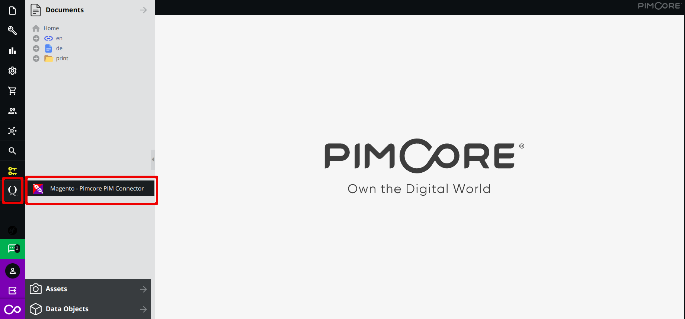
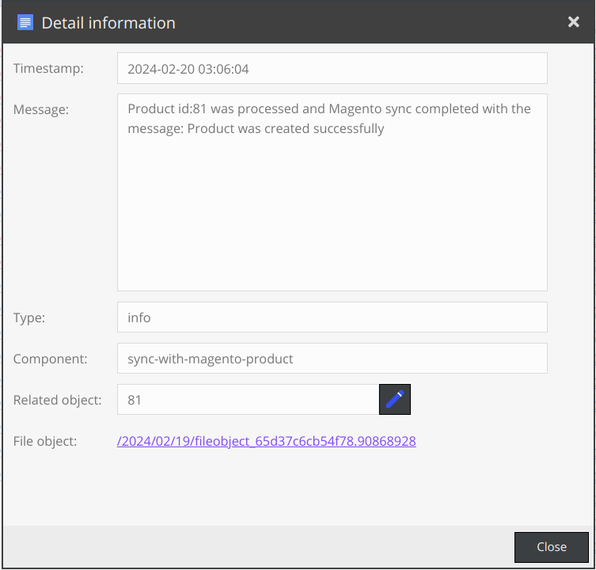

# Magento - Pimcore PIM Connector


Supported Version - 11.0.2 - Community Edition


## Table of Contents


[TOC]


## 1. Overview

The Magento-Pimcore PIM Connector extension facilitates seamless integration between a Pimcore and Magento store. The products imported from Pimcore are stored in appropriate Magento stores, according to the translation configuration.

A single product is synced at a time. The sync is triggered on publishing changes in Pimcore. 


## 2. Features
* **GraphQl Utilization:** Employs customized Magento GraphQl endpoint for faster results.
* **Token-Based Authentication:** Implements token-based authentication and whitelisting of source IP to secure endpoint.
* **Exclusive Authorization**: Allows Pimcore admins to secure the extension configuration page by authorizing users with appropriate bundle permission. \

* **Easy Configuration**: Simplifies data input and field mapping with a configuration page on the Pimcore side. 
* **Published Products Export**: Syncs only if the product is published in Pimcore. 
* **Real-Time Sync**: Provides real-time synchronization of changes made in Pimcore to Magento, simultaneously notifying users of these updates.
* **Attribute Sync**: Eliminates the need to create attributes in Magento for products synced from Pimcore with all existing attributes in Magento remaining unchanged. 
* **Translation Support**: Utilizes Magento’s multi-language support for products based on different store views. Users can map the language code and its appropriate Magento store view code in the Pimcore configuration. \

* **Media Library**: Detects and imports all media files associated with a product—a single image, a gallery, an external image URL, or a video. The extension automatically recognizes and imports the details into Magento alongside the product. 

    Note: Currently, Magento supports only YouTube and Vimeo videos. This extension operates adhering to this limitation.

## 3. Prerequisites

To use this extension:


* Install Magento - Pimcore PIM Connector available in [Magento Marketplace](https://commercemarketplace.adobe.com/partner/qburst-technologies#partner.products.info). Both extensions (Magento - Pimcore PIM Connector for Magento and PIM) should be installed on their respective platform stores for integration.
## 4. Installation
1. Connect to the server.
2. Run the following command on the Pimcore root directory to install the extension via the command line:

     
    `composer require qburst/productsyncbundle`

3. Add the bundle to your Kernel in **src/Kernel.php**.

    `public function registerBundlesToCollection(BundleCollection $collection): void`


    `{`


    `$collection->addBundle(\QBurst\ProductSyncBundle\QBurstProductSyncBundle::class, 70);`


    `}`

4. Run the following command to install the bundle:

     
    `php bin/console pimcore:bundle:install QBurstProductSyncBundle`


## 5. Authorization

Pimcore admins can authorize other users and roles to configure the extension. To authorize:


1. Select ‘Settings’ from the left navigation pane on the admin dashboard. A menu with various settings options appears.
2. Select Users/Roles from the menu. A sub-menu with Users, Roles, and Analyse Permissions options is displayed.
3. Select User or Role as required. A dashboard with the available users/roles is displayed.

 


4. Select the user or role that needs authorization. A dashboard with the details of the user/role is displayed.
5. Select ‘Settings’ from the top menu.
6. Click ‘+’ icon near ‘Permissions Bundles’. Options like ‘Admin Translations’, and ‘Application Logger’ are displayed. 

 


7. Find ‘Pimcore to Magento - Product Connector’ from the displayed options.
8. Check the box to authorize the user/role. 


>**Note: By default, admin users have been authorized to this bundle.**


## 6. Configuration

On successful installation, the QBurst logo appears in the admin dashboard. Click on this logo to view the Magento - Pimcore PIM Connector logo. To view the configuration page:

 


1. Select the ‘Magento - Pimcore PIM Connector’ option by clicking the QBurst logo in the admin dashboard. A dashboard to add configuration details is displayed. 




2. Configuration parameters are:

* **Mention the Target Pimcore Data Object Class Name**: Target Pimcore class name, from where the products should be exported to Magento.
* **Magento Website URL:** URL of the target Magento website.
* **Magento API Access Token: **API token generated in the Magento store integration. (Refer to Magento side documentation of Magento - Pimcore PIM Connector.)
* **List and Map the Magento Store Views and Language Translation**: To configure how the translated values of a product in Pimcore should be on Magento. For each language in Pimcore, Magento should have a corresponding store to accept these values. To map between a Pimcore language and a Magento store, use a colon operator. Separate each mapping using a space. Example:en:storeview1 fr:storeview2. 
    * In the above example, 'en' and 'fr' represent the language codes for 'English' and 'French' respectively. Obtain these language codes within Pimcore when configuring localization details under Settings > System Settings > Localization & Internationalization (i18n/l10n).
    * ‘storeview1’ and ‘storeview2’ are the store view codes from Magento, against which the English and French values are saved respectively. Get these from the column ‘Store View’ in  **_Stores > Settings > All Stores _**in Magento.
* **Product Name Field**: Field name in Pimcore source class which represents the product name value. ‘name’ is the default value here. Users can change it according to their requirements.
* **Product Description Field**:  Field name in the Pimcore source class that represents the product description value. ‘description’ is the default value here. Users can change it according to their requirements.
* **Product Short Description Field: **Field name in the Pimcore source class that represents the product short description value. ‘shortDescription’ is the default value here. Users can change it according to their requirements.
* **Product SKU Field**: Field name in the Pimcore source class that represents the product SKU value. Ensure this field is marked as a unique attribute in the Pimcore source class as the value from this field identifies the existing product in Magento. 

    Note: Magento only accepts unique values for this field. By marking this field as unique in Pimcore, users can replicate the same behavior on the Pimcore side and prevent an error of duplicate SKUs from Magento. 

* **Product Price Field**: Field name in the Pimcore source class that represents the product price value.
* **Product Quantity Field**: Field name in the Pimcore source class that represents the product quantity/stock value.
* **Product Status Field**: Field name in the Pimcore source class that represents the product status. The users are not allowed to change the default value, which is ‘published’.
* **Product Type Field**: Field name in the Pimcore source class that represents the parent product type. Refer ‘Object Type’ field in the [Pimcore demo project](https://github.com/pimcore/demo) for class ‘Cars’.
* **Configurable Product Value**: Value from the ‘Product Type Field’ field that represents the configurable product object.
* **Simple Product Value**: Value from the ‘Product Type Field’** **field that represents the simple/child product object.
* **Default Magento Category**: Category name in Magento to which the Pimcore products are assigned. These should be existing categories in Magento. Use a comma to separate the category names. Example: men,kurta.
* **Configurable Attributes**: Field names of attributes that are taken as configurable attributes in the Magento store. Specify additional attributes by separating them using a comma. Example: color,size.
* **Custom Attributes**: All fields are to be imported to the Magento store as custom attributes. Any field that was not included in the above configurations and needs to be imported to Magento along with the product should be mentioned here. Specify more than one attribute by separating them using a comma. Example: country.

```
**Note:**  
1. All fields on the configuration page are mandatory.
2. Mention the Object brick fields and relation fields in the configuration page using a dot operator. Example: salesInformation.condition or manufacturer.name, where salesInformation/manufacturer is the Object brick/relation field name and condition/name is the attribute within it.
3. Only mention the object brick details related to the target class. Skip the field name from the target class to which the object brick is related. 
4. This extension does not support related fields within an object brick.
```


## 7. Synchronization

After configuration, to verify if a product sync is triggered from Pimcore to Magento:


1. Select ‘Data Objects’ on the menu on the left side of the admin dashboard. A sub-menu with the folder hierarchy is displayed.
2. Create the required folder hierarchy under Data Objects. 


3. Under the newly created hierarchy, create an object of the target Pimcore class. 

```
**Note:  **
* As only simple and configurable products are being handled currently, make sure to follow the below hierarchy for each of these product types.
* A simple product should be created under the parent folder. Ensure the value mentioned in 'Simple product value' is selected against the field assigned in the 'Product type field'.
* A configurable product should be created under the parent folder itself. Ensure the value mentioned in 'Configurable product value' is selected against the field assigned in the 'Product type field'.
* A variant/child product should be created under the parent object/product (mentioned above). Ensure that, for a variant product, the value mentioned in 'Simple product value' is selected against the field assigned in the 'Product type field'.
```


4. Sync parameters are:
* **Attribute Values:** Assign values to configurable attributes for both the parent product and its variant products.
* **Product SKU:** Combine the Parent product SKU (as a prefix) and the value provided in Pimcore to generate the SKU for a child product in Magento.
* **Product Type:** Ensure that the correct value is assigned to the field designated as the 'Product Type Field' on the configurations page.
5. Click ‘Save & Publish’. Once synced, a success message is displayed on the bottom right corner of the screen.


>**Note:  The autosave functionality in Pimcore, which saves current changes as a draft, does not trigger the sync function.
Only the changes done to an object of the target Pimcore class are synced. No other class details, even if they have an established relationship with the target Pimcore class, are synced in this call.**


## 8. Logging

The status of the synchronizations from Pimcore to Magento is stored against each product under ‘Notes and Events’. To view details:


1. Select ‘Data Objects’ on the menu on the left side of the admin dashboard. A sub-menu with the folder hierarchy is displayed.
2. From the hierarchy, select the desired data object to open its edit page. Here ‘Special’ is selected.
3. Click the notes icon on the Data Objects edit page to view the synchronization information in the Notes & Events section.


4. The information displayed includes:

* **Type**: Value ‘sync-with-magento-product’ to identify the logging type
* **Title**: Title of the process
* **Description**: Status of the operation and any further details like error messages, if available
* **User**:  Details of the user who initiated the process
* **Date**: Timestamp at which the process was initiated


To view more details or debug the operations, we are logging all the details of each sync in Pimcore’s ‘PimcoreApplicationLoggerBundle’. If this bundle is not available, install it by running the following command:


    php bin/console pimcore:bundle:install PimcoreApplicationLoggerBundle

To view the logs:


1. Select ‘Tools’ from the left navigation pane of the admin dashboard. A menu with Glossary, Redirects, Recycle Bin, etc., is displayed.
2. Click ‘Application Logger’ to view the log entries.


3. The information displayed includes:

* **Timestamp**: The date and time of the process
* **Message**: Detailed information on the process and its status, and any applicable additional information
* **Type**: Based on the status of the process, this can be either ‘info’, ‘critical’, or ‘error’
* **File Object**: Payload structure and details created for the sync operation with Magento
* **Related Object**: Hyperlinked to the object in Pimcore that triggered the process (source product)
* **Component**: For this extension, the default value is ‘sync-with-magento-product’
* **Source**: By default, the file path and line number from where the message was logged





## 9. Translation

The extension handles the translated values for a field, attribute label, and drop-down option values based on Pimcore guidelines. 

The Pimcore guidelines are:


* Use the ‘localizedfields’ field type to have a translatable field in the class definition. This way, input field types like text can have their value across different languages.
* To translate the attribute label and drop-down options, use the ‘Admin translations’ under the settings options. Choose the message options on this page to add translations.
    * For attribute labels, the format for the translation key is ‘general.attrubteName’, where _attributeName_ is the attribute's name.
    * For drop-down option values, the translation key format is ‘attribute.optionName’ where _optionName_ is the drop-down option’s name.


## 10. Supported Field Types

This extension supports the following field types currently available in Pimcore. The field types have been mapped as follows in Magento:


| **Pimcore Field Type**                                   | **Magento Field Type** | 
|----------------------------------------------------------|------------------------|
| Input, Numeric, Time                                     | Text Field             |
| Textarea                                                 | Text Area              |
| WYSIWYG                                                  | Text Editor            |
| Checkbox                                                 | Yes/No                 |
| Date                                                     | Date                   |
| Date & Time                                              | Date and Time          |
| Select, Country, Language, manyToOneRelation             | DropDown               |
| Multiselection, Countries, Languages, manyToManyRelation | Multiple Select        |


## 11. Support

For any queries, reach out to [pimcore.support@qburst.com](mailto:pimcore.support@qburst.com).

